1. Entre na pasta do exercicio com o comando `cd exercise-prometheus`
2. Com a VPC, subnets e rotas utilizadas em aula provisionadas, entre na pasta terraform.
3. Se certifique no arquivo 'main.tf'que o count de workers esta com o valor '1'
4. Execute os comandos `terraform init` e `terraform apply --auto-approve`
5. Note que esse comando via montar um cluster swarm com um Manager e um Worker, além de colocar os aquivos necessários para o exercicio no Manager.
6. Utilize o DNS do manager da saida do terraform para acessar a maquina via SSH, como comando `ssh -i "fiap-lab.pem" ubuntu@DNS.manager` de dentro da sua maquina virtual
   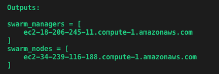
7. Ao entrar na maquina execute o comando `docker node ls` e verá que tem um cluster com 2 maquinas.
   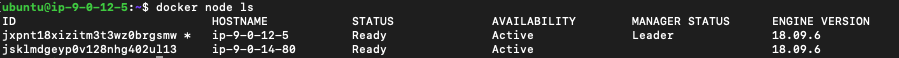
8. Primeiro vamos montar um registry local para distribuir as imagens pelo cluster. Para tal, execute o comando `docker service create --name registry --publish 5000:5000 registry:2`
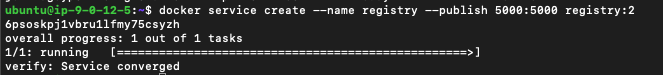
8. Para garantir que o serviço esta rodando no cluster execute o comando `docker service ls`. O campo REPLICAS tem que estar com o valor '1/1'
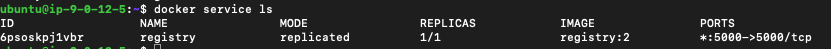   
9. Agora vamos preparar o ambiante para montar a imagem do prometheus que vamos utilizar no exercácio. Vamos copiar os arquivos do exercicio para a pasta principal
``` $bash
cp /tmp/Dockerfile $(pwd) 
cp /tmp/compose.yml $(pwd)
cp /tmp/prometheus.yml $(pwd)
```
10. Para montar a imagem execute o comando `docker build -t 127.0.0.1:5000/prometheus2 .`
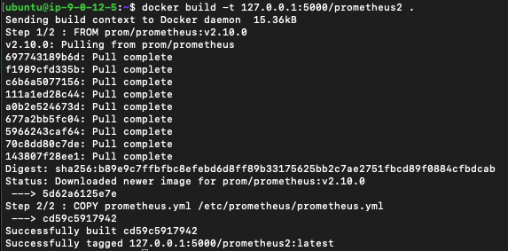
11. Faça o push da imagem que acabou de criar para o registry local com o comando `docker push 127.0.0.1:5000/prometheus2` 
12. Finalmente, vamos subir a stack de prometheus dentro das maquinas utilizando o comando `docker stack deploy -c compose.yml prometheus`
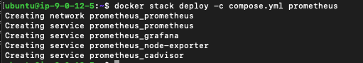
13. Após um pequeno periodo execute o comando `docker service ls` e ele deve estar como na imagem. Caso não esteja, aguarde mais um pouco.
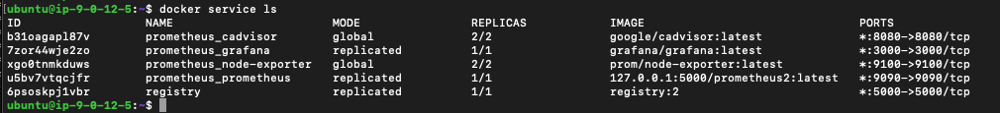
14. Em um navegador utilize o DNS do manager com a porta 9090 para acessar o painel do prometheus.
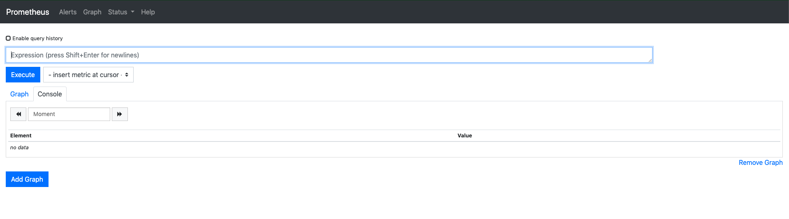
15. Clique em status para selecionar a opção targets
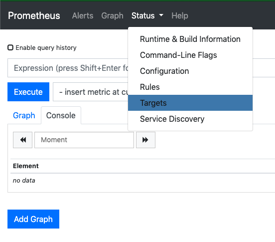
16. A tela deve estar como a imagem abaixo com todos os states em UP note que tanto o Cadvisor e os Nodes estão com 2 maquinas por que o cluster em 2 maquinas.
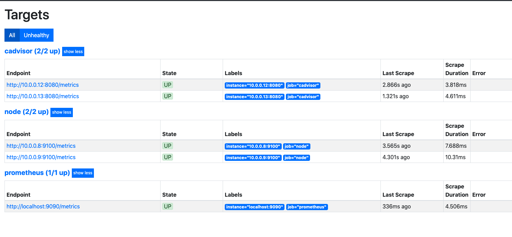
17. No menu superior clique em 'Graph'
18. Digite `rate(node_cpu_seconds_total[5m])` no campo de query e execute. Essa query lhe dará a utilização de cpu por nó e tipo nos ultimos 5 minutos.
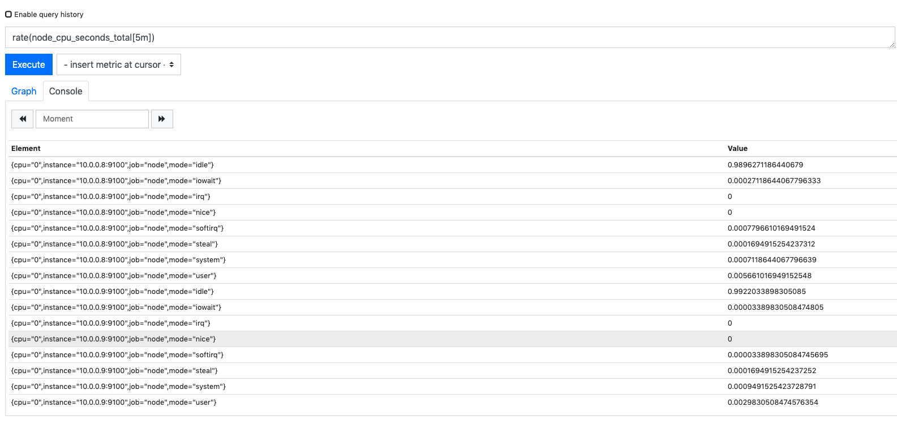
19. Vamos deixar essa query mais facil de ser lida mudando a sintaxe para `sum without(cpu, mode) (rate(node_cpu_seconds_total{mode!="idle"}[5m]))` . Agora estamos fazendo uma soma sem as dimensões cpu e mode, apenas nó, e filtrando o mode para não trazer nada com "idle".
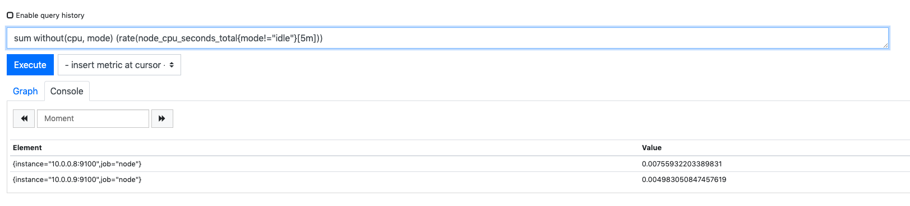
20. De volta a sua maquina virtual local, entre na pasta terraform e edite o arquivo 'main.tf' alterando o count dos workers para 4.
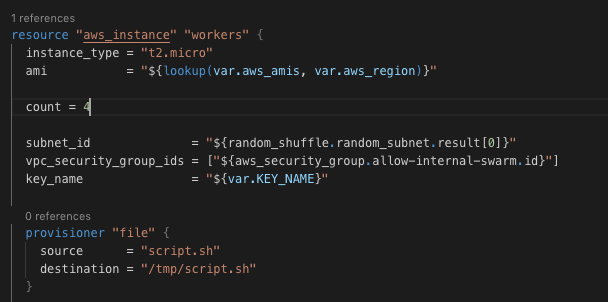
21. Execute o comando `terraform apply --auto-approve`
22. Ao final você terá adicionado 3 maquina no seu cluster. E ficará como na imagem abaixo.
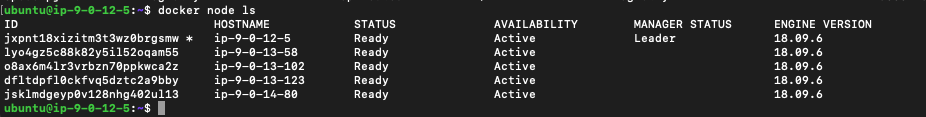
23. Como utilizamos a tag 'Global' em nosso compose. Os serviços de monitoramento também foram distribuidos para as novas maquinas assim que entraram no cluster. Note que os valores de REPLICAS do comando `docker service ls` mudaram.
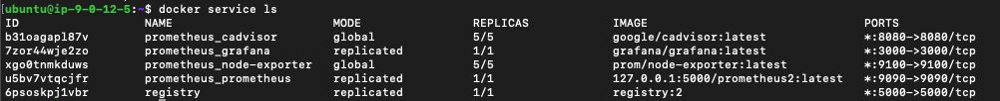
24. Volte a página de targets e verá que automaticamente os novos nós estão sendo monitorados. Caso não esteja como na imagem aguarde mais um momento.
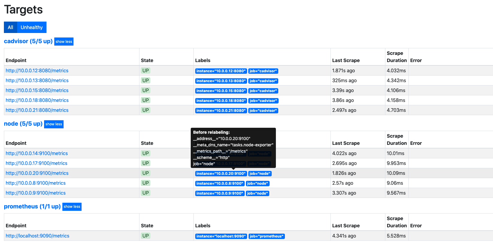
25. Em outra aba do Navegador utilize o DNS do manager com a porta 3000 para abrir o grafana.
26. Para entrar utilize usuario/senha `admin`, e coloque a senha que preferir.
27. Já dentro da ferramenta, clique em `add Source`
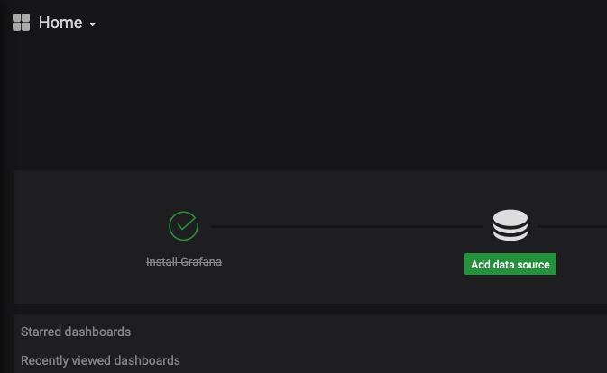
28. Escolha o prometheus
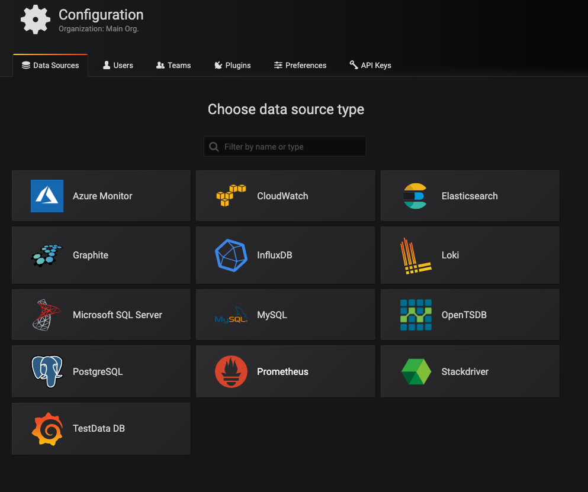
29. Na url coloque o valor `http://prometheus:9090` e clique em `Save & Test`
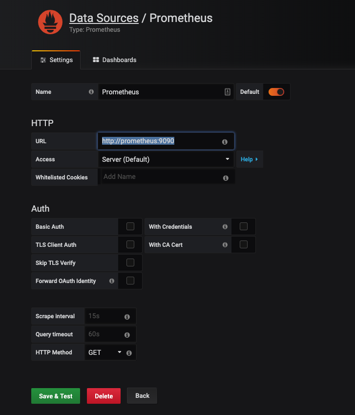
30. Assim que aparecer uma tarja verde com a frase `Data source is working`, clique em `Back` pois o data source já foi adicionado.
31. No menu lateral esquerdo, clique no sinal de '+' e em `Import`
32. Coloque o numero `1860` no campo 'Grafana.com Dashboard' e clique em 'Load'.
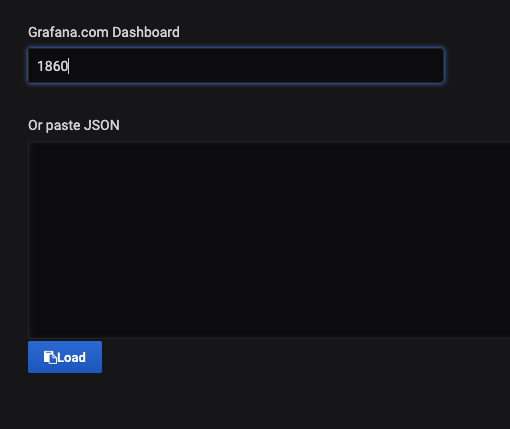
33. Selecione o Datasource `Prometheus` e clique em `Import`
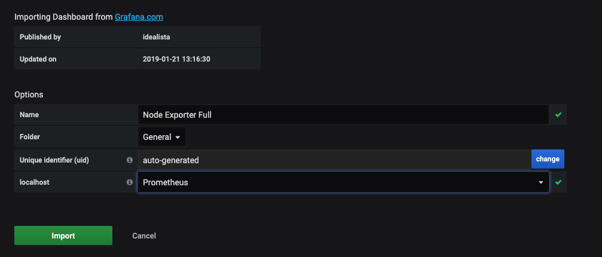
34. Acabamos de importar um dashboard da comunidade para nosso ambiente e conectar com nosso prometheus.
Você pode navegar pelos nós e ver como esta a performance deles individualmente. Para melhor visualização mude o filtro de tempo de 24 horas para os utilmos 5 minutos no canto superior direito.
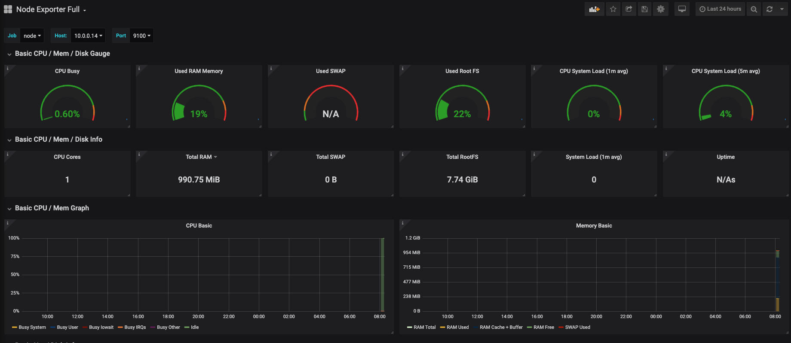
35. Para verificar qual a query em cada informação basta apenas clicar na seta ao lado do nome do painel escolhido e clicar em `edit`
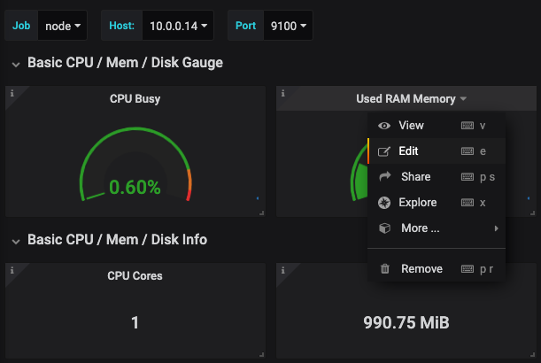
36. Note que a query esta utilizando as variáveis dos filtros do dashboard. ($node,$port,$job)
37. Expore o grafana e o Prometheus o quanto desejar.
38. Para destruir toda a stack utilize o comando `terraform destroy --auto-approve` na maquina virtual local.


